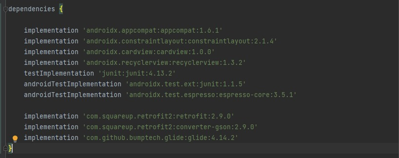
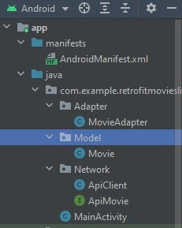
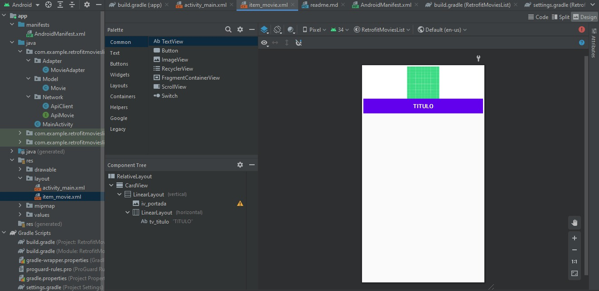
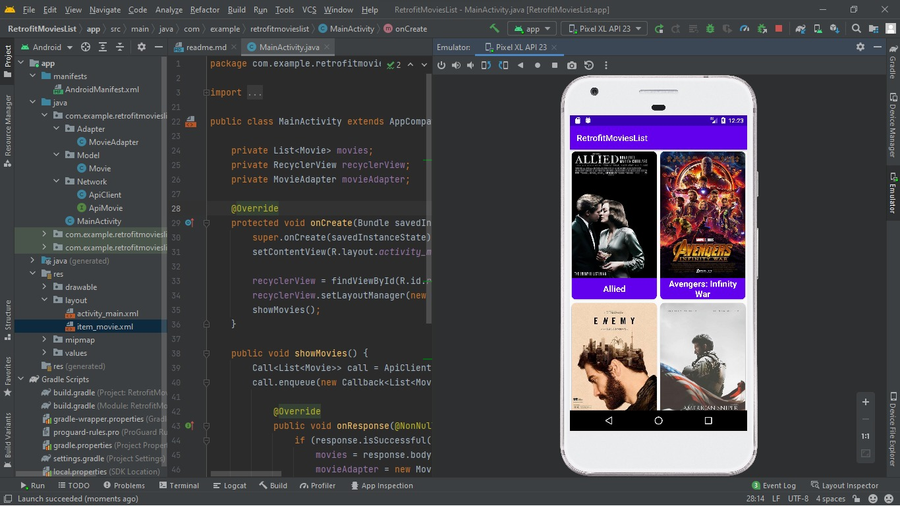
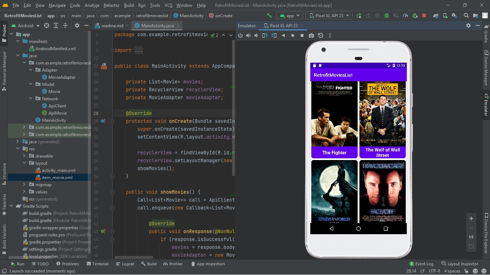

# Consumir API Retrofit (Java)

## Descripción
Consumir API de películas utilizando la biblioteca Retrofit.

## Capturas de Pantalla
- Instalación de Dependencias
  

- Lista de Paquetes
  

- Layout Películas
  

- Muestra App 1
  

- Muestra App 2
  

## Funcionalidades
Incluye los siguientes módulos y características:

- **ADAPTER**:
    - La clase MovieAdapter permite "Inflar" el diseño para visualizar los elementos de las películas.

- **MODEL**:
    - La clase Movie contiene los atributos que serán consumidos desde la API (la información que se verá en la app).

- **NETWORK**:
    - La clase ApiClient permite crear nuestro objeto Retrofit
    - La interfaz ApiMovie contiene el método GET para obtener los datos del API.

## Instrucciones para el desarrollo
1. Descargar zip

2. Activar xampp (Apache)

3. Xampp --> htdocs guardar zip Movies --> editar list.php ---> cambiar url y puerto

4. Verificar list.php en navegador --> http://192.168..../movies/list.php

5. Nuevo proyecto --> empty activity

6. Dependencias --> retrofit y glide

   implementation 'com.squareup.retrofit2:retrofit:2.9.0'
   implementation 'com.squareup.retrofit2:converter-gson:2.9.0'
   implementation 'com.github.bumptech.glide:glide:4.14.2'
   OPCIONAL --> Migrar proyecto a "AndroidX"

7. Package Model--> clase Movie
   --- > Mismos atributos del json (php.list) con getters y setters

8. Package Network --> clase ApiClient
   Crear objeto retrofit, obtener cliente

public class ApiClient {
private static Retrofit retrofit;

	public static Retrofit getClient(){
	retrofit = new Retrofit.Builder()
		.baseUrl("http://192.168.1.5:80/")
		.addConverterFactory(GsonConverterFactory.create())
		.build();
	return retrofit;
	}
}

9. Paquete Network --> interface --> ApiMovie

public interface apiMovie {
@GET("movies/list.php")
Call<List<Movie>> getMovies();
}

10. layout item_movie pegar del zip

11. layout activity main --> recycler view --> constraint
    --> recycler view --> asignar id rv_movies

12. paquete Adapter --> clase MovieAdapter
    public class MovieAdapter extends RecyclerView.Adapter<MovieAdapter.ViewHolder> {
    (crear clase view holder bombillo)
    (implementar métodos)
    (make view holder extend)
    (final de código --> crear constructor)
    }

--> Código ViewHolder
public class ViewHoIder extends RecycIerView. ViewHoIder {

private ImageView iv_portada
private TextView tv_titulo;
public ViewHoIder (@NonNuLL View itemView)
super(itemView) ;
iv_portada=itemView. findViewById (R. id. tv_portada) ;
tv_titulo=itemView. findViewById(R. id. tv_ titulo) ;

--> Código MovieAdapter Clase
private List<Movie>movies;
private Context context;

--> Código OncreateView
public ViewHolder onCreateViewHolder (@NonNull ViewGroup parent, int viewType{
View view = LayoutInflater.from(parent.getContext())
.inlfate(R.layout.item_movie,parent,attachToRoot: false);
return new ViewHolder(view);
}

--> Código onBindViewHolder-->
holder. tv _ titulo . set Text(movies. get (position) . getTituIo()) ;
Glide. with(context) . load (movies. get (position) . getPortada ( ) ) . into (holder. iv_portada);

--> getItemCount --> return movies.size();

13. MainActivity (clase)
    Declarar -->
    private List<Movie> movies;
    private RecyclerView recyclerView;
    private MovieAdapter movieAdapter;

OnCreate -->
recyclerView= findViewById (R.id.rv_movies) ;
recyclerView. setLayoutMInager(new gridlayoutmanager(getapolicationcontext(), spanCount: 2));

Código método ShowMovies
public void showMovies() {
Call<List<Movie>> call = ApiClient.getClient().create(ApiMovie.class).getMovies();
call.enqueue(new Callback<List<Movie>>() {

            @Override
            public void onResponse(Call<List<Movie>> call, Response<List<Movie>> response) {
                if (response.isSuccessful()) {
                    movies = response.body();
                    movieAdapter = new MovieAdapter(movies, getApplicationContext());
                    recyclerView.setAdapter(movieAdapter);
                }
            }

            @Override
            public void onFailure(Call<List<Movie>> call, Throwable t) {
                Toast.makeText(MainActivity.this, "Error, intente nuevamente", Toast.LENGTH_SHORT).show();
            }
        });
    }

--> Llamar en onCreate showMovies();

14. Permiso conexión a internet --> Manifest.xml

<uses-permission android:name="android.permission.INTERNET"></uses-permission>

android:usescleartraffic="true">

## Tecnologías Utilizadas
- Java
- Retrofit
- Glide

## Autor
Sebastián García Carmona
2023
---

¡Gracias por interesarte! Si tienes alguna pregunta o comentario, no dudes en ponerte en contacto.
